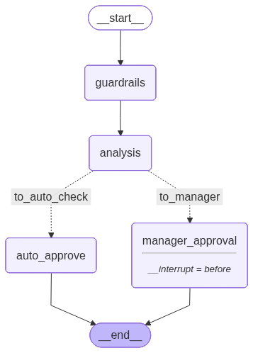

# 🔀 LangGraph — Orquestração do Fluxo de Crédito com Grafos de Estado

Este documento explica como o LangGraph é usado nesta aplicação para orquestrar o fluxo de análise de crédito. Todos os arquivos relacionados ficam em [`src/node/`](src/node/).

---

## O que é um Grafo de Estado

Um grafo de estado é uma forma de organizar um fluxo onde cada etapa é um **nó** e as transições entre elas são **arestas**. Diferente de um script linear (faça A, depois B, depois C), um grafo permite que o caminho mude dependendo do que aconteceu no passo anterior.

Imagine um fluxograma de decisão:

```
Início → Preparar dados → Analisar → É risco? → SIM → Gerente decide
                                              → NÃO → Aprovação automática
```

Isso é exatamente o que o LangGraph faz nesta aplicação. Cada caixa do fluxograma é um nó, e cada seta é uma aresta. A pergunta "É risco?" é uma **aresta condicional** — o caminho depende da resposta.

---

## Por que usar um Grafo em vez de um Script Linear

Em um script linear, o fluxo seria algo como:

```python
resultado = analisar(dados)
if resultado == "RISCO":
    aguardar_gerente()
else:
    aprovar()
```

Isso funciona para casos simples, mas tem limitações:

1. **Não pausa de verdade** — se o gerente não estiver disponível, o programa fica travado esperando
2. **Não salva o estado** — se o servidor reiniciar, perde tudo
3. **Não permite retomar** — não tem como o gerente acessar depois e continuar de onde parou

O LangGraph resolve esses três problemas com:

- **Checkpoints** — o estado é salvo automaticamente a cada nó executado
- **Interrupção** — o grafo pode pausar antes de um nó específico e liberar o processo
- **Retomada** — qualquer pessoa pode acessar o estado salvo e continuar a execução

---

## O Estado — CreditState

Todo grafo precisa de um estado compartilhado. É um dicionário tipado que todos os nós leem e escrevem. Nesta aplicação, o estado é definido em [`state.py`](src/node/state.py):

```python
# src/node/state.py
class CreditState(TypedDict):
    messages: Annotated[list[str], add_messages]
    cpf_original: str
    cpf_masked: str
    amount: float
    is_approved: bool
    analysis_report: str
    client_pattern: Literal["CONSERVADOR", "RISCO", "EXCECAO", "BLOQUEIO"]
```

Cada campo tem uma função:

| Campo | Tipo | Para que serve |
|---|---|---|
| `messages` | `list[str]` | Histórico de mensagens do fluxo (usa `add_messages` para acumular) |
| `cpf_original` | `str` | CPF real do cliente (entrada) |
| `cpf_masked` | `str` | CPF mascarado (preenchido pelo nó guardrails) |
| `amount` | `float` | Valor solicitado |
| `is_approved` | `bool` | Se o crédito foi aprovado (preenchido no final) |
| `analysis_report` | `str` | Relatório gerado pela IA |
| `client_pattern` | `Literal` | Classificação: CONSERVADOR, RISCO, EXCECAO ou BLOQUEIO |

O `Annotated[list[str], add_messages]` é um recurso do LangGraph que faz com que novas mensagens sejam **adicionadas** à lista em vez de substituí-la. Sem isso, cada nó que escrevesse em `messages` apagaria as mensagens anteriores.

---

## Os Nós

O grafo tem 4 nós, cada um com uma responsabilidade específica:

### Nó 1 — guardrails

```python
# src/node/state.py
def guardrails_node(state: CreditState):
    print(f"\nCPF Original: {state['cpf_original']}\n")
    return {"cpf_masked": state["cpf_original"]}
```

Este nó prepara os dados iniciais. Ele copia o CPF original para o campo `cpf_masked`. O mascaramento real não acontece aqui — ele acontece na camada de infraestrutura (LiteLLM + Presidio) quando o texto é enviado ao LLM.

O nó existe para que o grafo tenha um ponto de entrada claro onde os dados são validados e preparados antes da análise.

### Nó 2 — analysis

```python
# src/node/state.py
def analysis_node(state: CreditState):
    amount = state["amount"]
    raw_cpf = state["cpf_original"]

    result = rag_execute(raw_cpf, amount)

    try:
        agent_response = result["response"]
        response_text = agent_response.answer
        masked_cpf = state["cpf_masked"]
    except (KeyError, AttributeError):
        response_text = "ERRO: Resposta da IA em formato inválido."

    return {"analysis_report": response_text, "cpf": masked_cpf}
```

Este é o nó principal. Ele chama o serviço RAG completo ([`rag_service.py`](src/service/rag_service.py)), que:

1. Busca os chunks relevantes da política no ChromaDB
2. Gera uma análise de risco com a primeira chamada ao LLM
3. Monta o prompt final de auditoria
4. Envia ao LLM com ferramentas e recebe a resposta estruturada

O resultado é salvo no campo `analysis_report` do estado.

### Nó 3 — manager_approval

```python
# src/node/state.py
def manager_node(state: CreditState):
    print(f"\n[ALERTA] Gerente, analise o relatório: {state['analysis_report']}")
    return state
```

Este nó representa a intervenção humana. Quando o fluxo chega aqui, ele **pausa automaticamente** (graças ao `interrupt_before` configurado no grafo). O gerente pode então:

1. Visualizar o estado atual da proposta
2. Ler o relatório da IA
3. Decidir aprovar ou reprovar
4. Retomar o fluxo

### Nó 4 — auto_approve

```python
# src/node/state.py
builder.add_node(
    "auto_approve",
    lambda s: {
        "is_approved": True,
        "messages": ["SISTEMA: Processo concluído com aprovação."],
    },
)
```

Este nó é uma função lambda simples que marca o crédito como aprovado e adiciona uma mensagem de conclusão. Ele é usado quando o fluxo não precisa de intervenção humana.

---

## O Roteamento Condicional

Após o nó `analysis`, o grafo precisa decidir para onde ir. Essa decisão é feita pela função [`route_request()`](src/node/state.py:69):

```python
# src/node/state.py
def route_request(state: CreditState) -> Literal["to_manager", "to_auto_check"]:
    pattern = state.get("client_pattern")

    if pattern == "RISCO" or state["amount"] > 5000:
        return "to_manager"

    return "to_auto_check"
```

A lógica é:

- Se a IA classificou o cliente como **RISCO** → vai para o gerente
- Se o valor solicitado é **maior que R$ 5.000** → vai para o gerente (conforme Faixa C da política)
- Nos demais casos → aprovação automática

O roteamento é registrado no grafo assim:

```python
builder.add_conditional_edges(
    "analysis",
    route_request,
    {"to_manager": "manager_approval", "to_auto_check": "auto_approve"},
)
```

O primeiro argumento é o nó de origem. O segundo é a função que decide. O terceiro é um dicionário que mapeia o retorno da função para o nó de destino.

---

## O Grafo Completo

A montagem do grafo acontece no final de [`state.py`](src/node/state.py):

```python
# src/node/state.py
builder = StateGraph(CreditState)

# Registra os nós
builder.add_node("guardrails", guardrails_node)
builder.add_node("analysis", analysis_node)
builder.add_node("manager_approval", manager_node)
builder.add_node("auto_approve", lambda s: {...})

# Define as arestas
builder.add_edge(START, "guardrails")           # Início → guardrails
builder.add_edge("guardrails", "analysis")      # guardrails → analysis
builder.add_conditional_edges(                   # analysis → (condição)
    "analysis", route_request,
    {"to_manager": "manager_approval", "to_auto_check": "auto_approve"},
)
builder.add_edge("manager_approval", END)        # manager_approval → Fim
builder.add_edge("auto_approve", END)            # auto_approve → Fim

# Compila com checkpoint e interrupção
memory = MemorySaver()
graph = builder.compile(checkpointer=memory, interrupt_before=["manager_approval"])
```

Visualmente:

```
START → [guardrails] → [analysis] → (condição) → [auto_approve] → END
                                         │
                                         └──────→ [manager_approval] ⏸ → END
```

O símbolo ⏸ indica que o grafo pausa antes de executar o nó `manager_approval`.

---

## Checkpoint e MemorySaver

O `MemorySaver` é o mecanismo que salva o estado do grafo a cada nó executado. Ele funciona como um banco de dados em memória onde cada execução é identificada por um `thread_id`.

```python
memory = MemorySaver()
graph = builder.compile(checkpointer=memory, interrupt_before=["manager_approval"])
```

O `interrupt_before=["manager_approval"]` diz ao grafo: "quando for executar o nó `manager_approval`, pare e salve o estado". O processo não fica travado esperando — ele libera e pode ser retomado depois.

Cada execução é identificada por uma configuração:

```python
config = {"configurable": {"thread_id": "user_01"}}
```

O `thread_id` funciona como um identificador único da proposta. Diferentes propostas usam diferentes `thread_id`s e seus estados são independentes.

---

## Interrupção e Retomada — Human-in-the-Loop

O padrão **Human-in-the-Loop** significa que a IA faz o trabalho pesado (análise, classificação, relatório), mas a decisão final é de um humano. O LangGraph implementa isso nativamente com `interrupt_before`.

### Como funciona na prática

**1. O fluxo inicia e pausa:**

```python
config = {"configurable": {"thread_id": "user_01"}}
input_data = {
    "cpf_original": "123.456.789-00",
    "amount": 7500.0,
    "messages": []
}

# Executa até pausar antes do manager_approval
response = graph.invoke(input_data, config)
```

O grafo executa `guardrails` → `analysis` → detecta que o próximo nó é `manager_approval` → pausa e retorna o estado atual.

**2. O gerente inspeciona o estado:**

```python
snapshot = graph.get_state(config)
print(snapshot.values.get("analysis_report"))  # Lê o relatório da IA
print(snapshot.next)                            # Mostra: ('manager_approval',)
```

**3. O gerente decide e atualiza o estado:**

```python
graph.update_state(config, {"is_approved": True})
```

**4. O gerente retoma o fluxo:**

```python
graph.invoke(None, config)  # None = não é um novo fluxo, é retomada
```

O `None` como primeiro argumento indica que não estamos iniciando uma nova execução — estamos continuando de onde parou. O grafo executa o nó `manager_approval` e segue até o `END`.

---

## Testes

O arquivo [`state_test.py`](src/node/state_test.py) contém dois cenários de teste:

### Teste 1 — Fluxo completo com pausa e retomada

```python
# src/node/state_test.py
def execute_test():
    config = {"configurable": {"thread_id": "user_01"}}
    input_data = {
        "cpf_original": "123.456.789-00",
        "amount": 7500.0,       # Valor > 5000 → vai para o gerente
        "messages": []
    }

    # Executa até pausar
    response = graph.invoke(input_data, config)

    # Verifica que pausou
    snapshot = graph.get_state(config)
    print(f"Próximo nó na fila: {snapshot.next}")  # ('manager_approval',)

    # Retoma
    graph.invoke(None, config)

    # Estado final
    final_state = graph.get_state(config).values
    print(final_state)
```

Este teste simula uma solicitação de R$ 7.500 (Faixa C), que obrigatoriamente vai para o gerente. O fluxo pausa, e depois é retomado.

### Teste 2 — Gerente acessa proposta pausada

```python
# src/node/state_test.py
def execute_manager_aproval_test(thread_id: str, is_approved: bool = True):
    config = {"configurable": {"thread_id": thread_id}}

    # 1. Visualiza o estado
    current_state = graph.get_state(config)
    print(f"Valor: {current_state.values.get('amount')}")
    print(f"Análise: {current_state.values.get('analysis_report')}")

    # 2. Decide
    graph.update_state(config, {"is_approved": is_approved})

    # 3. Retoma
    graph.invoke(None, config)

    # 4. Verifica
    final = graph.get_state(config)
    print(f"Aprovado: {final.values.get('is_approved')}")
```

Este teste simula o gerente acessando uma proposta que já foi pausada pelo teste anterior (mesmo `thread_id`). Ele lê o relatório, decide aprovar ou reprovar, e retoma o fluxo.

Para executar os testes:

```bash
cd src/node && python state_test.py
```

---

## Visualização do Grafo

O grafo pode ser exportado como imagem PNG:

```python
graph.get_graph().draw_mermaid_png(output_file_path="graph.png")
```

.


---

## Resumo dos Conceitos

| Conceito | O que é | Como é usado nesta aplicação |
|---|---|---|
| **StateGraph** | Grafo onde os nós compartilham um estado tipado | `StateGraph(CreditState)` define o grafo com o estado de crédito |
| **Node (Nó)** | Função que recebe o estado, processa e retorna atualizações | `guardrails`, `analysis`, `manager_approval`, `auto_approve` |
| **Edge (Aresta)** | Conexão fixa entre dois nós | `guardrails → analysis`, `manager_approval → END` |
| **Conditional Edge** | Conexão que depende de uma função de decisão | `analysis → route_request() → manager ou auto_approve` |
| **Checkpoint** | Salvamento automático do estado a cada nó | `MemorySaver()` salva em memória, identificado por `thread_id` |
| **Interrupt** | Pausa do grafo antes de um nó específico | `interrupt_before=["manager_approval"]` pausa para o gerente |
| **Human-in-the-Loop** | Padrão onde a IA analisa e o humano decide | O gerente lê o relatório da IA e aprova/reprova |
| **add_messages** | Reducer que acumula mensagens em vez de substituir | `Annotated[list[str], add_messages]` no campo `messages` |
